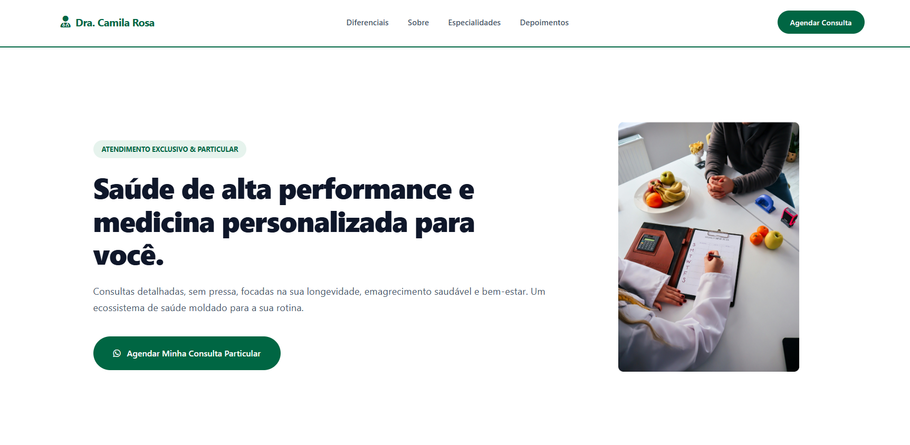

## 👨‍💻 Autor

Desenvolvido por **Riolly Mikael**.

* **GitHub:** [@riollymikael](https://github.com/riollymikael)


# 👩‍⚕️ Dra. Camila Rosa — Landing Page Médica

<div align="center">

  <!-- IMAGEM DE PREVIEW -->
  

  <br><br>

  <!-- BOTÕES DE ACESSO RÁPIDO -->
  <a href="https://riollymikael.github.io/landpage-medica/">
    
  </a>
  <a href="https://github.com/riollymikael/landpage-medica">
    
  </a>
  

</div>

---

## 📌 Sobre o Projeto

Uma landing page médica de alta conversão, elegante e 100% responsiva, desenvolvida para a **Dra. Camila Rosa**. O projeto foi estruturado para passar autoridade, confiança e facilitar o agendamento de consultas médicas e procedimentos.

### ✨ Diferenciais do Layout:
* 🩺 **Hero Section:** Chamada para ação (CTA) estratégica focada em agendamentos de consulta.
* 👩‍⚕️ **Sobre a Médica:** Apresentação profissional, qualificações e trajetória.
* 🏥 **Especialidades & Tratamentos:** Organização clara dos serviços médicos oferecidos.
* 💬 **Depoimentos de Pacientes:** Prova social para maior credibilidade e humanização.
* 📱 **Design 100% Responsivo:** Perfeita adaptabilidade para smartphones, tablets e computadores.

---

## 🛠️ Tecnologias Utilizadas

* **HTML5:** Estruturação semântica e acessível.
* **CSS3:** Estilização moderna com Flexbox e animações fluidas.

---

## 📂 Estrutura do Repositório

```text
landpage-medica/
│
├── images/              # Imagens do site e preview
│   ├── medico.jpg
│   ├── preview.png
│   └── sobre-medico.jpg
│
├── README.md            # Documentação do repositório
├── index.html           # Página principal
└── medico.css           # Estilos globais
